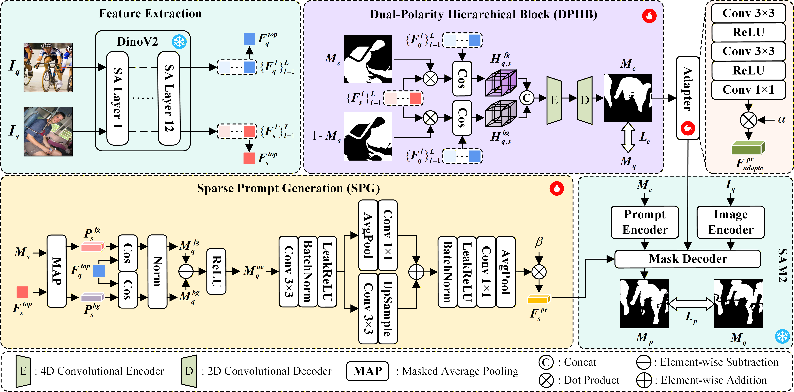

# [IJCNN 2026] EasyFSS: Dual-Polarity Matching and Multi-Prompt Guidance for Few-Shot Segmentation

---

Official code for IJCNN 2026 paper: EasyFSS: Dual-Polarity Matching and Multi-Prompt Guidance for Few-Shot Segmentation



## Abstract

---

Few-Shot Segmentation (FSS) aims to recognize and segment novel classes in images using only a limited number of
annotated examples. Recently, increasing efforts have explored incorporating foundation models (e.g., DINOv2 and SAM)
into FSS. However, existing pixel-wise matching approaches based on DINOv2 features often rely solely on
foreground-constrained modeling, resulting in less discriminative similarity responses and suboptimal dense prompts.
Moreover, relying solely on dense prompts remains inadequate for effectively guiding the Segment Anything Model (SAM)
family in constraining object boundaries and low-confidence regions.
To address these challenges, we propose EasyFSS, a SAM2-based few-shot segmentation framework that explicitly enhances
dense prompts quality while introducing complementary sparse prompts.
Specifically, based on multi-level DINOv2 features, we construct a Dual-Polarity Hierarchical Block (DPHB), extending
foreground-constrained modeling to foreground–background polarity matching across semantic hierarchies. This design
significantly enhances the discriminability of pixel-wise similarity responses and alleviates background-induced
ambiguity.
Furthermore, we design a Sparse Prompt Generation (SPG) module that leverages global prototypes and multi-scale spatial
context to generate high-confidence sparse prompts, effectively constraining boundaries and low-confidence regions.
Finally, dense and sparse prompts collaboratively guide the SAM2 decoding process, enabling accurate and reliable
segmentation predictions.
Extensive qualitative and quantitative experiments demonstrate that EasyFSS achieves state-of-the-art performance, with
1-shot mIoU improvements of 3.2% and 3.9% on PASCAL-5<sup>i</sup> and COCO-20<sup>i</sup>, respectively.

## Requirements

### 1. Environment Setup

```bash
conda create -n EasyFSS python=3.12
conda init bash && source ~/.bashrc
conda activate EasyFSS
```

---

### 2. PyTorch

```bash
# PyTorch 2.7.0 with CUDA 12.6
pip install torch==2.7.0 torchvision==0.22.0 torchaudio==2.7.0 --index-url https://download.pytorch.org/whl/cu126
```

### 3. DINOv2 Dependencies

```bash
# CUDA 12.6 compatible
pip install -U xFormers==0.0.30 --index-url https://download.pytorch.org/whl/cu126
```

### 4. SAM2 Dependencies

```bash
pip install hydra-core==1.3.2 iopath>=0.1.10 pillow>=9.4.0
```

### 5. Basic Dependencies

```bash
pip install matplotlib==3.9.0 tensorboardX scikit-learn albumentations tqdm einops timm
```

## Datasets

---

You can follow [HSNet](https://github.com/juhongm999/hsnet) to prepare few-shot segmentation datasets.

> ### 1. PASCAL-5<sup>i</sup>
> * **Option 1: Official setup**
>
>  Download PASCAL VOC2012 devkit (train/val data):
>  ```bash
>  wget http://host.robots.ox.ac.uk/pascal/VOC/voc2012/VOCtrainval_11-May-2012.tar
>  ```
>  Download SDS extended mask annotations
>  from [Google Drive](https://drive.google.com/file/d/10zxG2VExoEZUeyQl_uXga2OWHjGeZaf2/view?usp=sharing)
> 
> * **Option 2: Quick setup**
>  
>  Use our preprocessed dataset: [VOC2012.zip](https://drive.google.com/file/d/1YWtvoAHW0QjVsiHNX4jdbHYpJzb-4dyr/view?usp=drive_link).

> ### 2. COCO-20<sup>i</sup>
> * **Option 1: Official setup**
>  
>  Download COCO2014 train/val images and annotations:
>  ```bash
>  wget http://images.cocodataset.org/zips/train2014.zip
>  wget http://images.cocodataset.org/zips/val2014.zip
>  wget http://images.cocodataset.org/annotations/annotations_trainval2014.zip
>  ```
>  Download COCO2014 train/val annotations from our Google Drive: [train2014.zip](https://drive.google.com/file/d/1cwup51kcr4m7v9jO14ArpxKMA4O3-Uge/view?usp=sharing), [val2014.zip](https://drive.google.com/file/d/1PNw4U3T2MhzAEBWGGgceXvYU3cZ7mJL1/view?usp=sharing). (
and locate both train2014/ and val2014/ under annotations/ directory).
> * **Option 2: Quick setup**
>  
>  Use our preprocessed dataset: [COCO2014.zip](https://drive.google.com/file/d/1RFaZ7M2afuesxZnbxcijm6MsZI3Etquz/view?usp=drive_link).

> ### 3. FSS-1000
> Download FSS-1000 images and annotations from our [FSS-1000.zip](https://drive.google.com/file/d/1UxmsE-EZr091CIkeRDWvvbEyRrSJnUTA/view?usp=drive_link).


Create a directory `./Datasets_MyNet` for the above three few-shot segmentation datasets and appropriately place each
dataset to have following directory structure:

```bash
./                      # parent directory
├── ./                  # current (project) directory
│   ├── checkpoints/    # (dir.) pretrained weights for DINOv2 and SAM2
│   ├── common/         # (dir.) helper functions
│   ├── data/           # (dir.) dataloaders and splits for each FSSS dataset
│   ├── dinov2/         # (dir.) official DINOv2 implementation
│   ├── model/          # (dir.) implementation of model
│   ├── sam2/           # (dir.) official SAM2 implementation
│   ├── README.md       # instruction for reproduction
│   ├── train.py        # code for training
│   └── test.py         # code for testing
└── Datasets_MyNet/
    ├── VOC2012/                    # PASCAL VOC2012 devkit
    │   ├── Annotations/
    │   ├── ImageSets/
    │   ├── ...
    │   └── SegmentationClassAug/
    │
    ├── COCO2014/
    │   ├── annotations/
    │   │   ├── train2014/
    │   │   ├── val2014/
    │   │   └── ...
    │   ├── train2014/
    │   └── val2014/
    │
    └── FSS-1000/
        ├── abacus/
        ├── ...
        └── zucchini/
```

## Backbone checkpoints

---

Download the pretrained weights for DINOv2 and SAM2: [Google Drive](https://drive.google.com/drive/folders/1wnTFsWIodK5Gg36WRrN33Uh8mkdSQIdf?usp=sharing)

```bash
checkpoints/
├── dinov2_vitb14_pretrain.pth     # DINOv2 (ViT-B/14)
├── sam2.1_hiera_base_plus.pt      # SAM2 (base model)
└── ...                            # other variants (small, large, etc.)
```

## Training

---

> ### 1. PASCAL-5<sup>i</sup>
>
> ```bash
> python train.py --sam2_backbone_size base
>                 --dinov2_backbone_size base
>                 --datapath "your_datasets_path"
>                 --fold {0, 1, 2, 3}
>                 --benchmark pascal
>                 --epoch 30
>                 --bsz 20
> ```

> ### 2. COCO-20<sup>i</sup>
>
> ```bash
> python train.py --sam2_backbone_size base
>                 --dinov2_backbone_size base
>                 --datapath "your_datasets_path"
>                 --fold {0, 1, 2, 3}
>                 --benchmark coco
>                 --epoch 15
>                 --bsz 20
> ```

### Babysitting Training

Use tensorboard to monitor training progress:

- For each experiment, a directory that logs training progress will be automatically generated under `logs/`.
- From terminal, run:
  ```bash
  tensorboard --logdir logs/
  ```
- Choose the best model when the validation (mIoU) curve starts to saturate.


## Testing

---

> ### 1. PASCAL-5<sup>i</sup>
>
> Pretrained models with tensorboard logs are available on our [Google Drive](https://drive.google.com/drive/folders/1FheV9OoEd2p470QnMtjiH6Td5R8eXqhk?usp=sharing).
>
> ```bash
> python test.py --sam2_backbone_size base
>                --dinov2_backbone_size base
>                --fold {0, 1, 2, 3}
>                --benchmark pascal
>                --nshot {1, 5}
>                --load "path_to_trained_model/best_model.pt"
> ```

> ### 2. COCO-20<sup>i</sup>
>
> Pretrained models with tensorboard logs are available on our [Google Drive](https://drive.google.com/drive/folders/1FheV9OoEd2p470QnMtjiH6Td5R8eXqhk?usp=sharing).
>
> ```bash
> python test.py --sam2_backbone_size base
>                --dinov2_backbone_size base
>                --fold {0, 1, 2, 3}
>                --benchmark coco
>                --nshot {1, 5}
>                --load "path_to_trained_model/best_model.pt"
> ```

## Visualization

---

- To visualize mask predictions, add command line argument `--visualize`:  
  (prediction results will be saved under `vis/` directory)

```bash
python test.py ...other arguments... --visualize
```

## References

---

This repo is mainly built based
on [HSNet](https://github.com/juhongm999/hsnet), [FounFSS](https://github.com/DUT-CSJ/FoundationFSS), [CMap-SAM](https://github.com/Chenfan0206/CMaP-SAM), [DINOv2](https://github.com/facebookresearch/dinov2)
and [SAM2](https://github.com/facebookresearch/sam2). Thanks for their great work!
